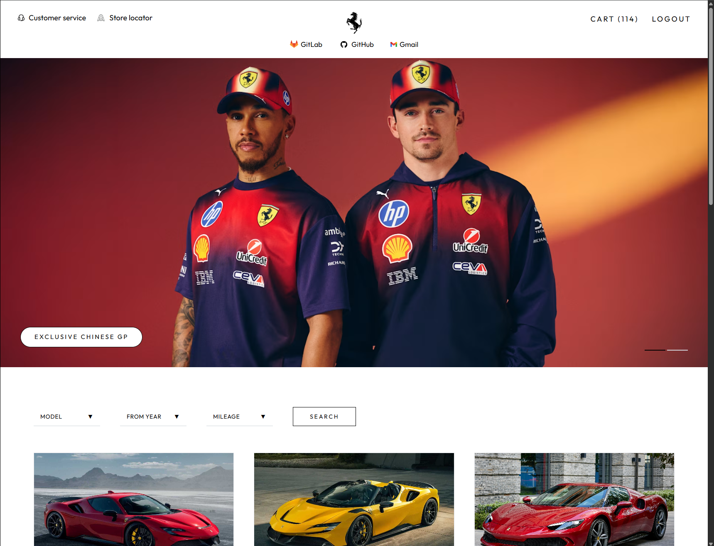
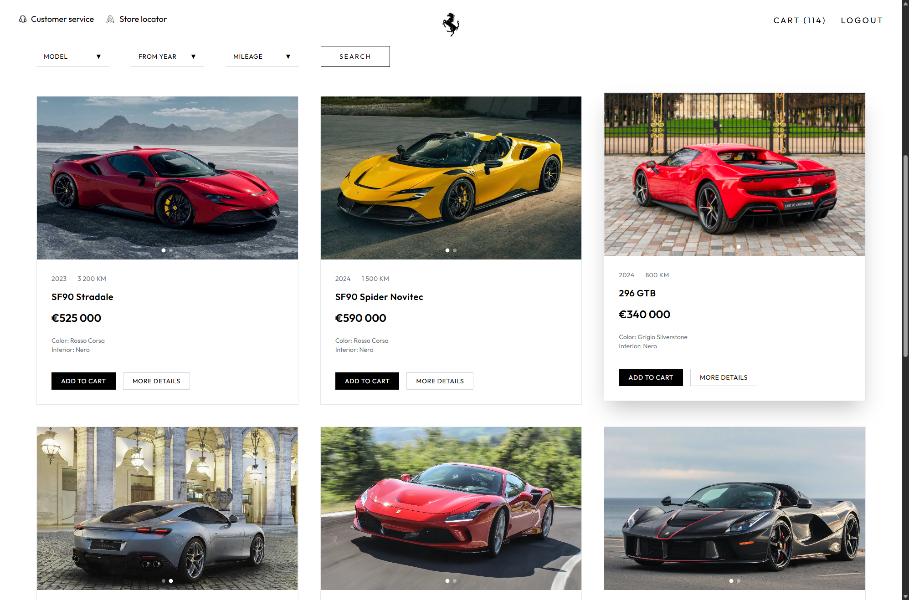
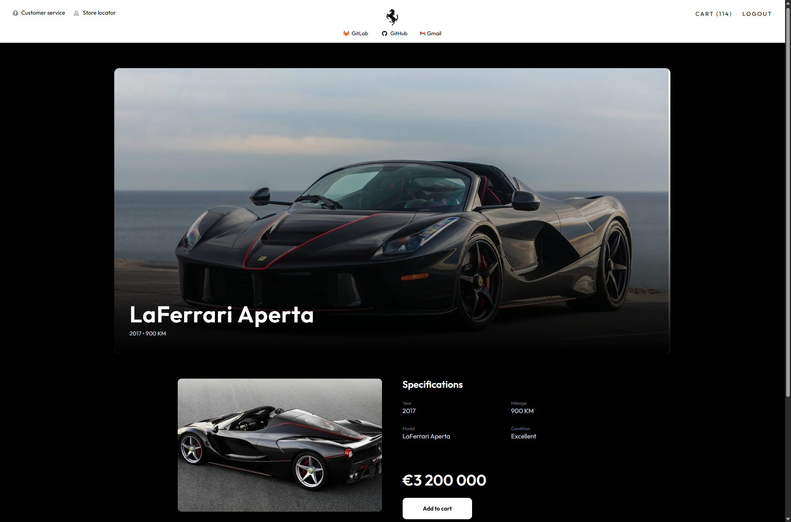
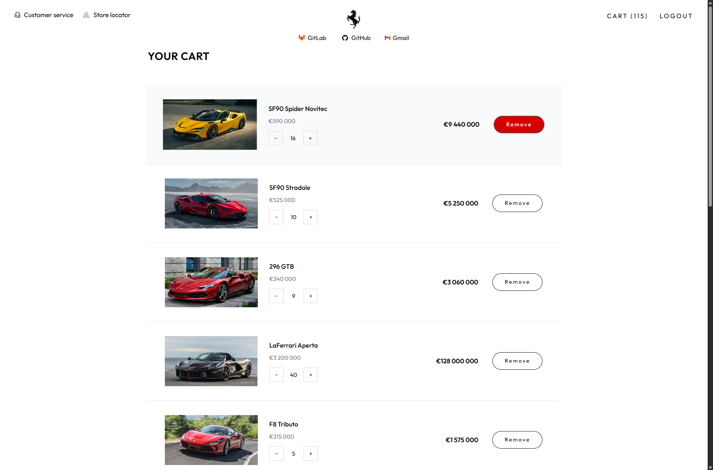

# Ferrari Showcase

Live Demo: https://ferrari-showcase-dkwp-6mh3b7rok-shurikaglug-4489s-projects.vercel.app

A premium full-stack web application inspired by Ferrari design philosophy.

This project represents a luxury car catalog with authentication, protected routes, and a fully functional shopping cart system. The focus is on building a real-world application with clean architecture, smooth UX, and production-level patterns.

---

##  Features

###  Authentication & Security
- JWT-based authentication (login / registration)
- Protected routes (frontend + backend)
- Token validation via middleware
- Input validation and error handling
- Persistent auth state

---

###  Cart System
- Add / remove products
- Quantity management
- Cart persistence via localStorage
- Cart tied to authenticated user
- Safe hydration logic (prevents overwriting user data)

---

###  Car Catalog
- Interactive Ferrari car catalog
- Dynamic routing for car details pages
- Image sliders with drag support
- Smooth transitions and hover interactions

---

###  UI / UX (Ferrari-inspired)
- Minimalistic premium design (black / red palette)
- Responsive layout for all screen sizes
- Micro-interactions (hover, press, feedback)
- Smooth animations and transitions
- Clean spacing and typography system

---

###  Frontend Architecture
- Feature-based folder structure
- Reusable UI components
- Centralized state management (Redux Toolkit)
- Custom hooks
- API abstraction layer using Axios

---

###  Backend (Node.js / Express)
- REST API architecture
- JWT authentication
- Middleware-based request handling
- Controllers / routes separation
- Models for users and cars
- Seed data for initial content

---

##  Technical Highlights

- Proper cart hydration logic (prevents race conditions)
- Separation of concerns (UI / logic / API)
- Optimized rendering with React hooks (useEffect, useMemo)
- Clean and scalable architecture
- Real-world frontend + backend interaction

---

##  Tech Stack

### Frontend
- React
- TypeScript
- Redux Toolkit
- Tailwind CSS
- SCSS

### Backend
- Node.js
- Express
- JWT

---

## Screenshots

<p align="center">
  
  
</p>

<p align="center">
  
  
</p>

---

## Installation

### Frontend

```bash
npm install
npm run dev
